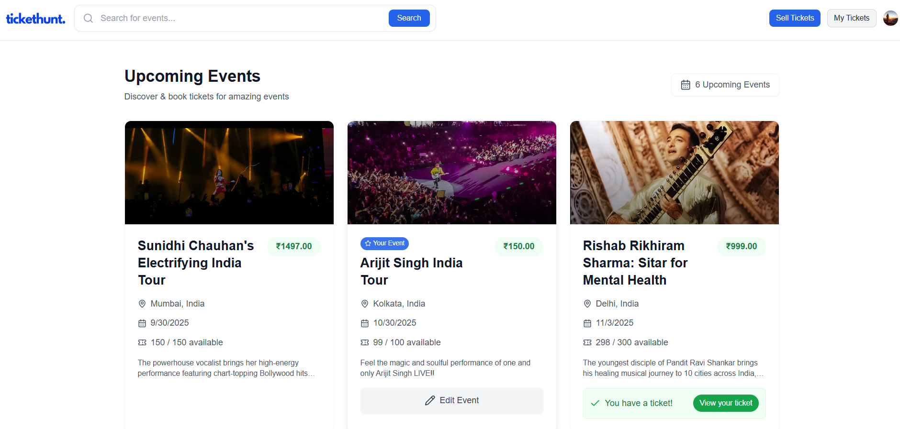
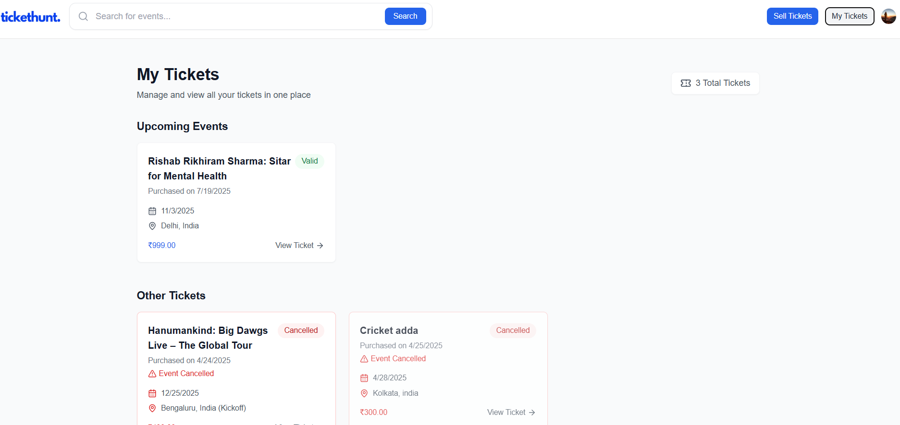
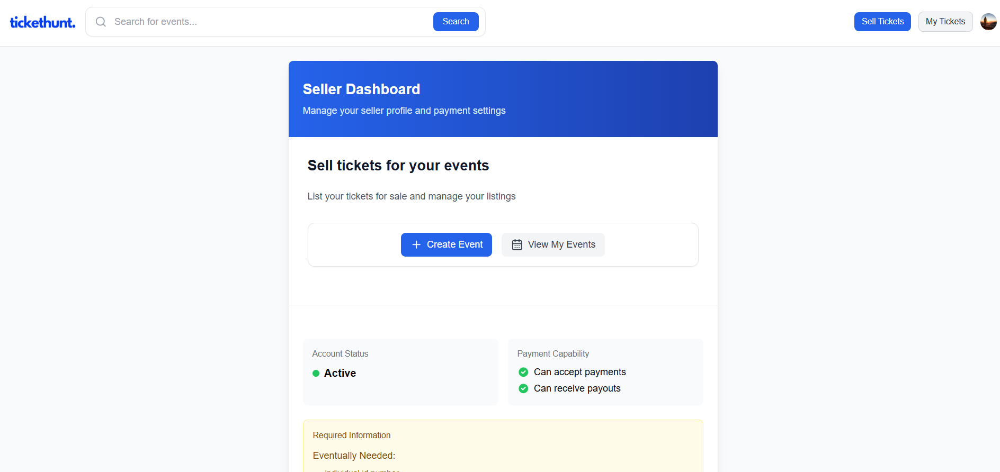
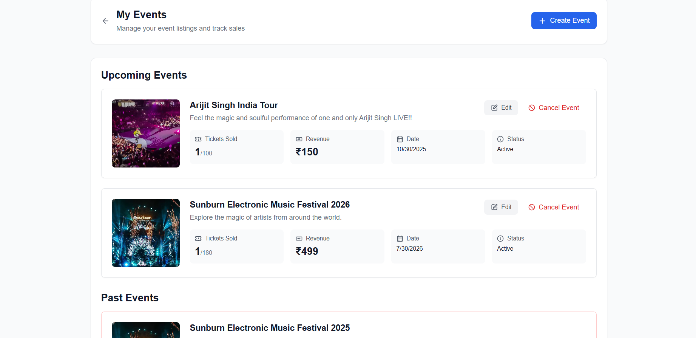
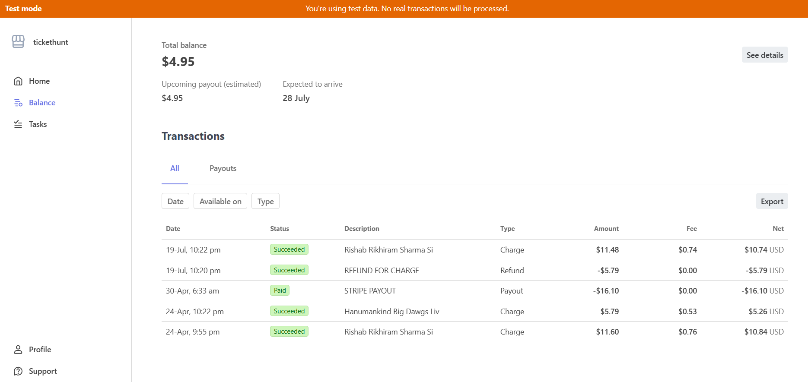

# Tickethunt 🎟️

<div align="center">
  
**Tickethunt** is a real-time event ticketing platform built with **Next.js 14**, **Convex**, **Clerk**, and **Stripe Connect**. It provides secure ticket sales, smart queuing, and real-time updates for attendees and organizers.

</div>

## 📸 Platform Preview

### 🏠 Landing Experience

*Modern, responsive landing page with event discovery and real-time availability*

### 🎫 User Dashboard - My Tickets

*Digital ticket wallet with QR codes and purchase history*

### 📊 Organizer Dashboard

*Real-time sales monitoring and event management for organizers*

### 🎯 Event Management

*Create, edit, and monitor events with advanced analytics*

### 💰 Payment Processing

*Secure payment processing and transaction management*

## ⚙️ Tech Stack

- **Next.js 14** – App Router, SSR/CSR
- **Convex** – Real-time backend & database
- **Clerk** – Authentication & user management
- **Stripe Connect** – Payment processing & marketplace payouts
- **Tailwind CSS** & **shadcn/ui** – Modern UI components
- **TypeScript** – Type-safe development

## 🎯 Features

### For Event Attendees
- 🎫 Real-time ticket availability tracking
- ⚡ Intelligent queue system with position updates
- 🕒 Time-limited purchase offers
- 💳 Secure Stripe payment processing
- 📱 Digital tickets with QR codes
- 📲 Mobile-optimized experience
- 💸 Automatic refunds for cancelled events

### For Event Organizers
- 💰 Direct payouts via Stripe Connect
- 📊 Real-time sales dashboard
- 🎯 Automated queue management
- 📈 Event analytics and insights
- 🔄 Bulk refund processing
- 🎟️ Customizable ticket limits
- ❌ Event cancellation with auto-refunds

### Technical Features
- 🚀 Real-time updates with Convex
- 👤 Seamless authentication with Clerk
- 🌐 Server-side and client-side rendering
- 🛡️ Rate limiting and fraud prevention
- 🔔 Toast notifications
- ♿ Accessible components
- 📱 Responsive design

## 🚀 Quick Start

### Prerequisites
- Node.js 18+
- Stripe, Clerk, and Convex accounts

### Installation

```bash
git clone https://github.com/SubhadeepMondal2023/tickethunt-project.git
cd tickethunt-project
npm install
```

### Environment Setup

Create `.env.local`:

```env
# Convex
NEXT_PUBLIC_CONVEX_URL=your_convex_url

# Clerk
NEXT_PUBLIC_CLERK_PUBLISHABLE_KEY=your_clerk_key
CLERK_SECRET_KEY=your_clerk_secret

# Stripe
STRIPE_SECRET_KEY=your_stripe_secret
STRIPE_WEBHOOK_SECRET=your_webhook_secret
NEXT_PUBLIC_STRIPE_PUBLISHABLE_KEY=your_stripe_public

# App
NEXT_PUBLIC_APP_URL=http://localhost:3000
```

### Development

```bash
# Start Next.js
npm run dev

# Start Convex (separate terminal)
npx convex dev
```

## 🔧 Setup Guides

### Clerk Authentication
1. Create account at [clerk.com](https://clerk.com)
2. Add your keys to `.env.local`
3. Configure redirect URLs

### Convex Backend
1. Create account at [convex.dev](https://convex.dev)
2. Run `npx convex init`
3. Deploy with `npx convex deploy`

### Stripe Payments
1. Create Stripe account and enable Connect
2. Install Stripe CLI: `npm install -g stripe`
3. Forward webhooks: `stripe listen --forward-to localhost:3000/api/webhooks/stripe`
4. Add webhook secret to `.env.local`

### UI Components
```bash
npx shadcn-ui@latest init
npx shadcn-ui@latest add button card dialog toast
```

## 📱 How It Works

### Ticket Purchase Flow
1. Browse events with real-time availability
2. Join smart queue system
3. Receive time-limited offer
4. Complete secure checkout
5. Get digital ticket with QR code

### Event Management
1. Complete Stripe Connect onboarding
2. Create event with details and capacity
3. Monitor real-time sales dashboard
4. Process automatic payouts

## 🏗️ Architecture

```
Frontend (Next.js) → Convex (Real-time Backend) → Database
      ↓                     ↓
Clerk (Auth)         Stripe (Payments)
```

### Core Collections
- **Events** - Event details, pricing, capacity
- **Tickets** - Purchase records, QR codes
- **Queue** - User positions, wait times
- **Users** - Profiles, purchase history

## 🚀 Deployment

### Vercel (Recommended)
```bash
npm i -g vercel
vercel --prod
```

### Production Checklist
- [ ] Update environment variables
- [ ] Configure webhooks
- [ ] Test payment flow
- [ ] Verify real-time features

## 🤝 Contributing

1. Fork the repository
2. Create feature branch: `git checkout -b feature/name`
3. Commit changes: `git commit -m 'Add feature'`
4. Push to branch: `git push origin feature/name`
5. Submit pull request
